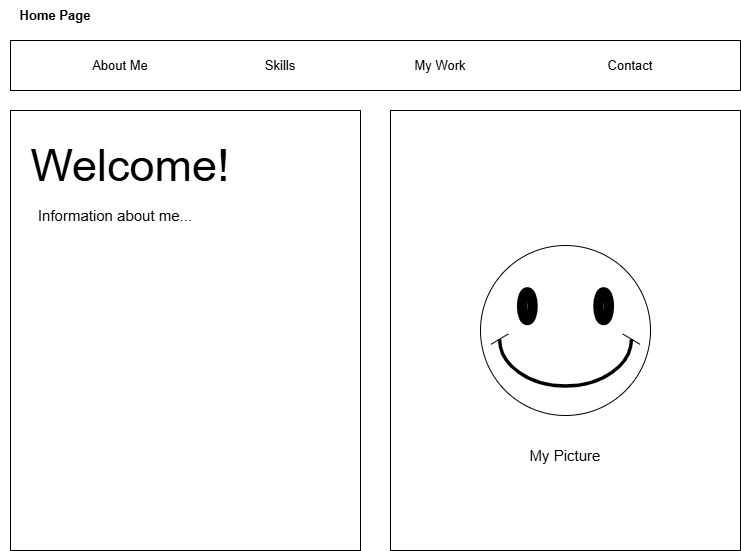

# Feature: Home Page 

## Goal 
implement `index.html` 

## Designs 
 

## Work
### Describe specifically the UI/UX clearly 
#### What elements exist? What container elements exist? 
- Horizontal Navigation Bar
- Float
- Image
- Class
- Grid

#### How do users interact? What is the hover behavior?
- Users interact using the buttons on the navigation bar. The hover behavior will just show a darker shade of the nav bar.

## Deliverables  
#### What does “done” look like? Be concrete and testable
- Once the buttons on the nav bar works which links to the other pages of the website. When everything looks aesthetically to my liking.

## Latest Implementation Decisions

- Decided to go for a "modern" / "technology" look
- Added hover buttons (that don't go anywhere) about my soft skills... Looks good aesthetically!

## Review
- `index.html` looks fine.
- my website does not follow responsive design in terms of mobile layout. i forgot to do mobile layout first, so i might need to readjust everything.
- need to use an `srceset` for the image 